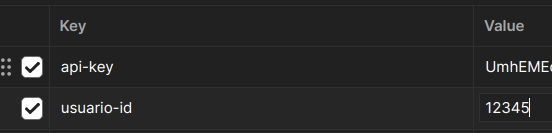

Todos los endpoint de la API necesitan autenticación para poder ejecutarlos, para ello necesita primero ingresar un usuario válido en el *endpoint Login del módulo Auth*, este módulo verificará que el usuario que ingrese este activo, le regresará un JSON con la siguiente información:

```js
{
    "usuario_id: 12345,
    "api_key": "apiKeyCode"
}
```

Estas credenciales serán válidas por una hora, pasado ese tiempo tendrá que generar un nuevo login.

En cada petición tendrá que incluir los siguientes headers:



En la documentación de OpenAPI verá que estos dos parámetros se repetirán mucho, pues son necesarios para poder acceder a los endpoints de la API.