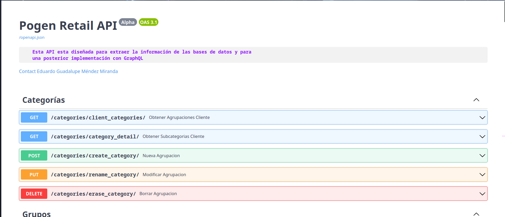
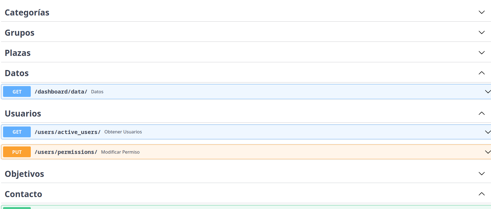
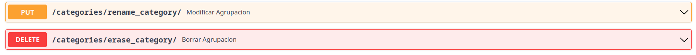
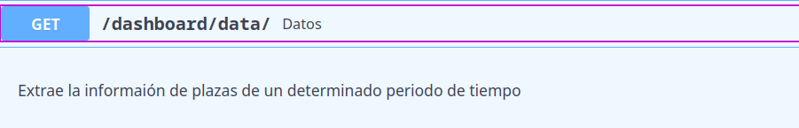
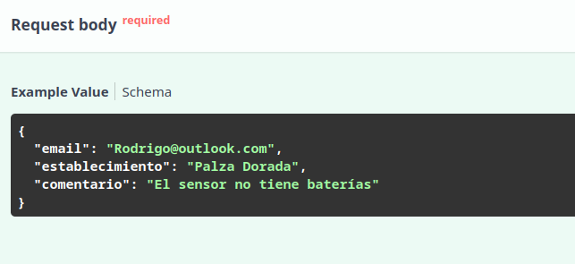
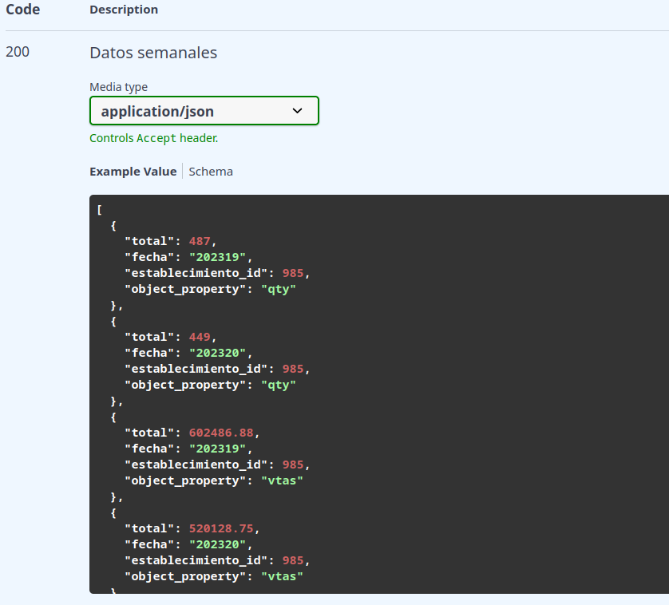

Al utilziar FastAPI se tiene la ventaja de que la documentación se genera de una manera semi-automática utilizando OpenJSON, para acceder a la documentación pruebe en ir a la ruta /docs del host en dónde levantó la API (ej: http://0.0.0.0:8000/docs), allí podrá visualizar la siguiente pantalla:

Para entender esta documentación analizemos sus elementos:

1. Categorías / Tags

Los endpoints de la API están agrupados por tags dentro de la aplicación, por lo que si busca algún endpoint relacionado, por ejemplo, con la obtención de usuarios, puede dirigrse a la categoría "Usuarios" y buscar dicho endpoint.

2. Información del endpoint

Cada dropdown de los endpoints contiene la información necesaria para saber su método y su ruta, en el siguiente ejemplo tenemos dos endpoints con los métodos PUT y DELETE, si quisiera acceder al endpoint PUT, entonces tendría que acceder mediante la ruta http://HOST:PUERTO/categories/rename_category/

3. Descripción y datos necesarios

Una vez que seleccione un endpoint visualizará un pequeño recuardro con la información de lo que hace.

Debajo de este recuadro encotrará los parámetros necesarios o el formato del body que el endpoint necesita, en la mayoría de los endpoints los parámetros estarán acompañados de una descripción y un ejemplo.

En este ejemplo podemos ver que el endpoint tiene como parámetros nombre y grupo_id, además de los headers de autenticación que son necesarios para este.

En este otro ejemplo se puede apreciar el formato necesario de un body request el cuál será necesario para que el endpoint acepte la petición:

4. Respuesta del endpoint

Si desea saber que tipo de respuestas puede devolver un endpoint o el formato de estas, al final de los datos puede encontrar una sección con ejemplos de respuestas que puede arrojar una petición hacía ese endpoint.

