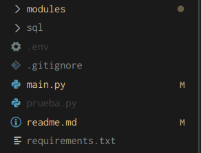

Al entrar al directorio de la aplicación podrá apreciar la siguiente estructura:

El contenido de las carpetas y archivos es el siguiente:

+ modules: Aquí se encuentran todos los endpoints del proyecto, están separados en diferentes archivos, cada archivo representa una ruta diferente en la API, los endpoints están organizados para que coincidan con la organización de las páginas de Retail, es decir, los endpoints del módulo categories están destinados a ser utilizados en la página de agrupaciones, los endpoints de goals se usan en la página de objetivos.
+ sql: Solo contiene un archivo con las conexiones hacía las bases de datos de PogenData y Retail.
+ .env: En este archivo se deberán declarar las variables de entorno necesarias para el proyecto.
+ .gitignore: Archivo git ignore.
+ main.py: Es el principal archivo del proyecto, aquí se declara el objeto FastAPI el cuál contiene toda la información de la API, además de que aquí se importan los routers de los modulos para incorporarlos a la aplicación, así como los metadatos de la API.
+ readme.md: Archivo readme informativo.
+ requirements.txt: Contiene todas las dependencias necesarias para el proyecto
