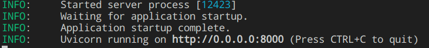
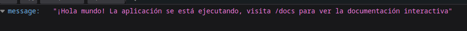

# Antes de iniciar

## Primeros pasos

Antes de ejecutar la API, se recomienda crear un entorno virtual para instalar todas las dependencias dentro de este, para hacerlo, ejecute en el intérprete de comandos la instrucción para crear un entorno virtual con Python:

```sh
python -m venv /path/to/venv
```

Para activarlo, posicionese en la carpeta donde fue creado el entorno virtual y activelo con el comando:

```sh
source bin/activate
```
Una vez activado correctamente el entorno, proceda a installar las dependencias del archivo *requirements.txt* que se encuentra en la carpeta raíz del proyecto ejecutando el siguiente comando:

```sh
pip install -r requirements.txt
```

**NOTA: la aplicación esta creada con Python 11, por lo que es posible que algunas versiones de las librerías no esten disponibles para otras versiones de Python por lo que tendrán que ser instaladas manualmente, es posible que el proyecto funcione de manera extraña con otras versiones de las librerías.**

## Variables de entorno

Por seguridad, los datos sensibles dentro de la aplicación no estan escritos en texto plano, estos datos se consiguen a través de un archivo *.env* que usted deberá crear en **la carpeta raíz** del proyecto al momento de descargar el repositorio, esta es la lista de las variables de entorno necesarias para que la aplicaicón funcione correctamente

+ RETAIL_HOST : Host de la base de datos de Retail
+ RETAIL_DB : Base de datos de Retail a la que desea conectarse
+ RETAIL_USER : Usuario de la base de datos de Retail
+ RETAIL_PW : Contraseña del usuario Retail
+ DATA_HOST : Host de la base de datos de PogenData
+ DATA_DB : Base de datos de PogenData a la que desea conectarse
+ DATA_USER : Usuario de la base de datos de PogenData
+ DATA_PW : Contraseña del usuario PogenData
+ RECIPIENT_EMAIL : Correo al que se enviarán los reportes de las plazas en el módulo contacto
+ SANDBOX_EMAIL : Email proporcionado por la API de Mailgun para enviar correos
+ MAILGUN_APIKEY : API Key para utilizar la API de Mailgun

# Iniciando el proyecto

Habiendo instalado las dependencias necesarias para el proyecto, ejecute el siguiente comando para iniciar un servidor de Uvicorn desde la carpeta del proyecto

```sh
uvicorn main:app --host 0.0.0.0 --port 8000
```

El comando de uvicorn recibe como parámetro el nombre del archivo .py principal del proyecto, junto con ello, también se recibe el nombre del objeto FastAPI que contiene toda la aplicación, además recibe como opciones el host y el puerto en el que se desea ejecutar (también es posible agregar la opción --reload por si es necesario editar el código y que se actualize la API en automático cada vez que el código es modificado).
Al ejecutar este comando verá el siguiente output en la terminal:



Si visita la dirección desde su navegador web deberá de poder visualizar el siguiente mensaje:



Si ha logrado ver esa pantalla, entonces ha logrado hacer que la aplicaicón funcione correctamente.

# Docker

Actualmente la aplicación no esta dockerizada, se espera su implementación próximamente.